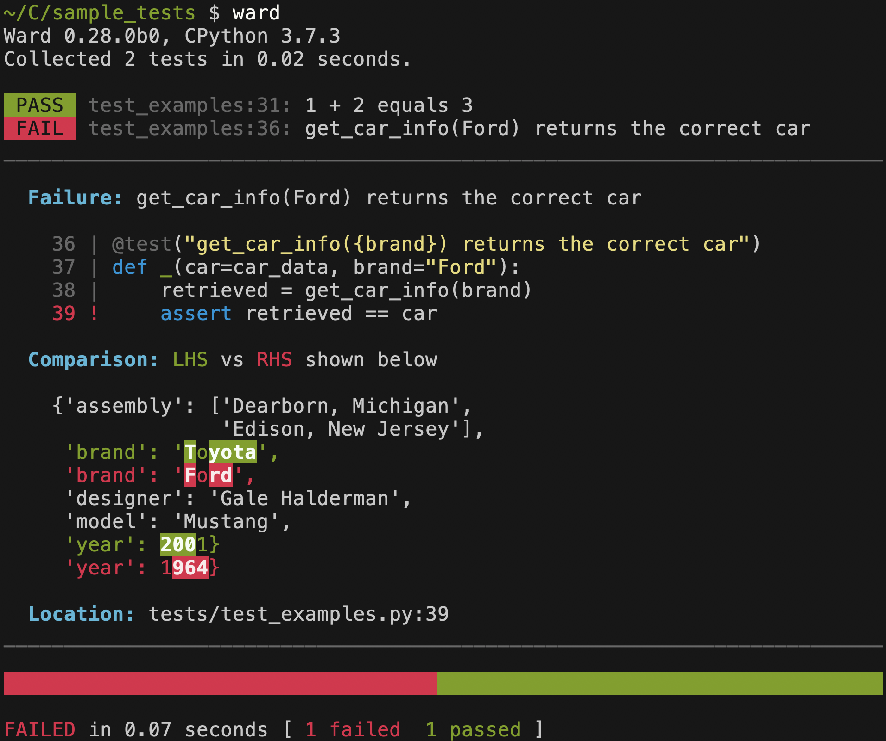

Here are some of the key differences between ward and pytest. This article assumes a working knowledge of pytest concepts.

## Fixtures

In pytest, you inject a fixture into a test by defining a parameter of the same name. To share pytest fixtures across files, you can place them in a `conftest.py` file.

```python
@pytest.fixture
def num():
    return 42

def test_number_is_42(num):  # param name must match fixture name
    assert num == 42
```

In ward, you inject a fixture by importing it and binding it as a default argument in your test. This means IDE features such as "go to definition" work for fixtures. You don't need to learn rules for fixture resolution or worry that you may override a fixture or inject the wrong one.

```python
@fixture
def num():
    yield 42

@test("the number is 42")
def _(n=num):
    expect(n).equals(42)
```

Alternatively, you can use the `@using` decorator to bind a fixture to a positional argument: 

```python
@test("the number is 42")
@using(n=num)
def _(n):
    expect(n).equals(42)
```

To share ward fixtures across files, you can just import them as you would any other Python function. In both ward and pytest, you can execute teardown code in a fixture by placing it after a yield statement.

## Declaring tests

Pytest test names must begin with the word "test". They can be functions or methods in a class.

In ward, tests are indicated using the `@test(description)` decorator. The function itself can be named `_`, since the name would likely just repeat the description in a less readable form. Class level tests are not supported.

In both cases, tests are collected from modules starting with the word "test". With pytest, it can also end with "test".

## Performance

To check the performance overhead of both ward and pytest, I generated 10,000 passing test cases (only the name/description differs between each of them), each of which depends on two fixtures.

The time taken to run all 10,000 passing tests was as follows (mean across 10 runs):

- **pytest**: 20.9s
- **ward**: 11.7s

For pytest, each test looked like this:

```python
@pytest.fixture
def one():
    return 1
    
@pytest.fixture
def two():
    return 2

# 10k instances of the test below
def test_<num>(one, two):
    assert one + two == 3
```


In the case of ward, the test cases looked like this:

```python
@fixture
def one():
    return 1
    
@fixture
def two():
    return 2

# 10k instances of the test below
@test("I am test <num>")
def _(one=one, two=two):
    expect(one + two).equals(3)
```

Since ward has more verbose test output than pytest by default, it was configured to output test results in a style almost identical to pytest. With this configuration, both frameworks output a module name followed by a single dot representing each passing test in the module.


This situation is of course unrealistic, but it does measure at a basic level the overhead of each framework when running simple tests.

## Fixture scopes

Pytest currently supports `function`, `class`, `module`, `package` and `session` scopes. As of v5.2, it now supports dynamic scopes.

Ward currently supports `Test` (which I think is equivalent to pytest `function` scope), `Module` and `Global` (same as pytest `session`) scopes.

## Assertions

Pytest supports assertion rewriting, meaning you can use the Python `assert` statement and still get detailed information on the assertion should it fail.

Ward has an API for making assertions called the expect API, which is similar to popular testing frameworks in other languages. It performs no AST manipulation/inspection, and runs no import hooks unlike pytest. Currently, you can use `assert` in Ward, but you won't get detailed information/diffs about failing tests:


I may add the assert rewriting to Ward in the future, depending on the performance impact. I'd like to first understand how much of the pytest framework overhead comes from AST manipulation.

Examining production Python codebases at FanDuel, I've found the vast majority of pytest `assert` statements we use are of the form `assert x`, `assert x == y` or `assert x in y`. Although I do believe the ability to use `assert` is "nicer", I'm not convinced that the overhead of learning a few simple API methods is problematic.

## Parameterisation

In pytest, you can parameterise tests using the `pytest.mark.parametrize` decorator:

```python
@pytest.mark.parametrize("test_input,expected", [("3+5", 8), ("2+4", 6), ("6*9", 42)])
def test_eval(test_input, expected):
    assert eval(test_input) == expected
```

This test translated into ward would look like:

```python
@test("eval returns expected output")
def _(
  test_input=each("3+5", "2+4", "6*9"),
  expected=each(8, 6, 42),
):
  expect(eval(test_input)).equals(expected)
```

There appears to be [no simple way](https://github.com/pytest-dev/pytest/issues/349) to use a fixture when parameterising a test in pytest. In ward, if you refer to a fixture when parameterising, it will be resolved:

```python
@fixture
def forty_two():
  yield 42

@test("eval returns expected output")
def _(
  test_input=each("3+5", "2+4", "6*9"),
  expected=each(8, 6, forty_two),
):
  expect(eval(test_input)).equals(expected)
```

Pytest also lets you parameterise fixtures themselves. Ward does not support this.

## Output

A comparison between the output of Pytest and Ward is shown below.

Pytest was run with the `-v` flag in order to display the full diffs
for failing tests. Unfortunately, when you run pytest with `-v`, *all*
of the output becomes more verbose. If you want to see a full diff for 
any tests that fail, you have to accept that pytest will print each test
on a separate line during the run:


Ward relies on colours rather than symbols to present diffs:



There's currently no option in Ward to get a symbolic diff for
failing tests, meaning if your terminal or CI server doesn't support
coloured output, diffs will be useless. This is a known limitation and
will be fixed in a future iteration.

## Development

Pytest is a mature production ready testing framework. On the other hand, Ward has not been production tested and is currently marked as an alpha.

## Extensibility

Pytest has a plugin system powered by `pluggy`. Ward does not yet have a
plugin system.