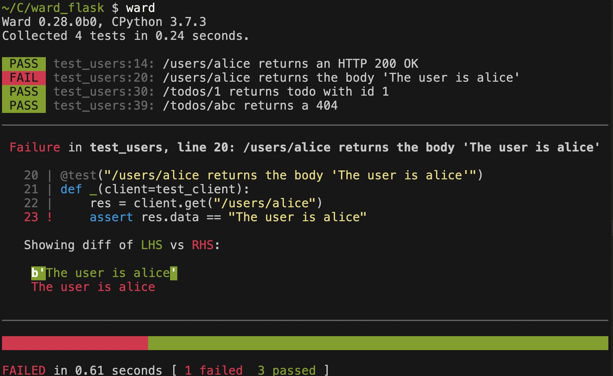
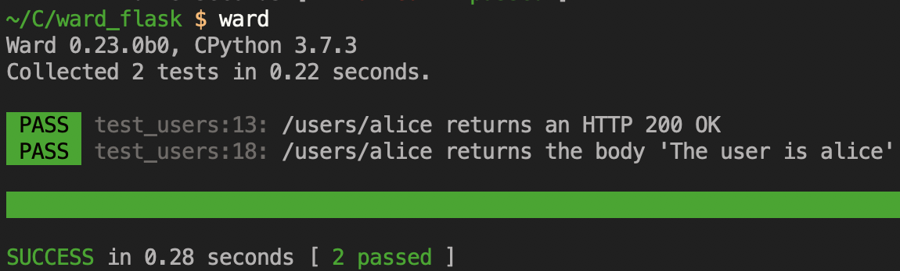

import {TerminalCommand, PassMarker, FailMarker, Blue} from "../../components/ward-test-output"

Let's write a couple of tests using Ward for the following Flask application (`users.py`).

It's an app that contains a single endpoint. If you run this app with `python -m users.py`,
then visit `localhost:5000/users/alice` in your browser, you should see that the application
returns the response `The user is alice`.

```python
from flask import Flask

app = Flask(__name__)

@app.route("/users/<str:username>")
def get_user(username: str):
    return f"The user is {username}"
    
if __name__ == '__main__':
    app.run()
```

The most common way of testing Flask APIs is using the helpful `TestClient` it provides.
Using `TestClient`, we can easily make requests to our app, and see how it behaves and responds.

Before going any further, let's install Ward and Flask:

<TerminalCommand>
pip install ward flask
</TerminalCommand>

Create a new file called `test_users.py`, and inside it, let's define a [fixture](/guide/fixtures) to configure
the Flask application for testing. We'll *inject* this fixture into each of our tests, and this will allow us to
send requests to our application and ensure it's behaving correctly!

```python
from ward import fixture
from users import app

@fixture
def test_client():
    app.config['TESTING'] = True  # For better error reports    
    with app.test_client() as client:
        yield client
```

This fixture yields an instance of the `TestClient`, which can be accessed from the `Flask` object we
used to create our app. The fixture will be regenerated before each test that depends on it. This is 
because the scope of the fixture is, by default, `"test"`.

Yielding the client from within the `with` statement means that any resources
used by the client will be cleaned up after each test runs.

Now we'll create our first test, which will check that our app returns the correct HTTP status code when we
visit our endpoint with a valid username (`"alice"`). The status code we expect to see in this case is an HTTP 200 (OK).

```python
from ward import fixture, test

# ... test_client fixture defined here ...

@test("/users/alice returns an 200 OK")
def _(client=test_client):
    res = client.get("/users/alice")
    assert res.data == "The user is alice"
```

We can run our test by running `ward` in our terminal:


Success! It's a <PassMarker>PASS</PassMarker>! The fully green bar indicates a 100% success rate!

**<Blue>TIP:</Blue>** If we had lots of other, unrelated endpoints in our API and we only wanted
to run the tests that affect the `/users/` endpoint, we could do so using the following command.

<TerminalCommand>
ward --search <Blue>"/users/"</Blue>
</TerminalCommand>

Let's add another test below, to check that the body of the response is what we
expect it to be.

```python
@test("/users/alice returns the body 'The user is alice'")
def _(client=test_client):
    res = client.get("/users/alice")
    assert res.data == "The user is alice"
```

Running our tests again, we see that our new test <FailMarker>FAILS</FailMarker>!



Looking at our output, we can see that while we expected the output to 
be `The user is alice`, it was *actually* `b'The user is alice'`. Ward
highlights the specific differences between the expected value and the actual
 value in bright red. 

This test failed because because `res.data` returns a `bytes` object, not a string like our
we thought when we wrote our test. Let's correct the test.

```python
@test("/users/alice returns the body 'The user is alice'")
def _(client=test_client):
    res = client.get("/users/alice")
    assert res.data == b"The user is alice"
```

If we run our tests again, we see that they both <PassMarker>PASS</PassMarker>!



