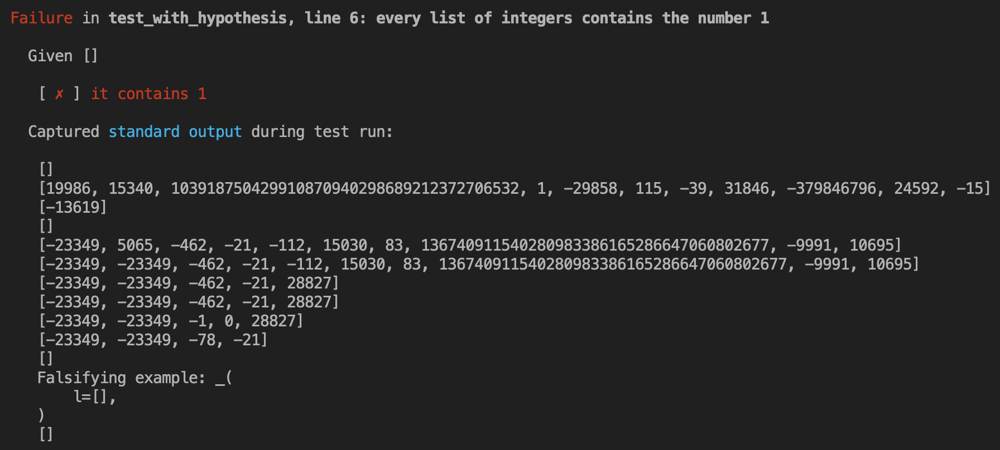

import {TestOutputLine, TerminalCommand, PassMarker, FailMarker} from "../../components/ward-test-output"
import Warning from "../../components/warning"

<Warning>
** This page is a work in progress and is currently incomplete! **
</Warning>
<br/>

You can use [Hypothesis](https://hypothesis.readthedocs.io/en/latest/) with Ward out of the box.

Hypothesis must be installed separately:

<TerminalCommand>pip install hypothesis</TerminalCommand>

<Warning>When using Hypothesis with Ward, you must use the `@using` decorator
in order to inject fixtures into tests. Hypothesis does not support
tests with default arguments.</Warning>
<br/>

Here's an example of a <FailMarker>FAIL</FailMarker>ing test that uses Hypothesis. It makes
the rather strange assertion that every list of integers contains the integer `1`, 
which obviously isn't true, but provides us an example of how Hypothesis works.

```python
from hypothesis import given
from hypothesis.strategies import lists, integers
from ward import expect, test

@test("every list of integers contains the number 1")
@given(l=lists(elements=integers()))
def _(l):
    print(l)  # Let's print out the list to see what's happening!
    expect(l).contains(1)
```

Hypothesis calls the test above multiple times. Each time it calls it,
it passes a different list of integers into the test. Each of these calls are known
 as "examples". We don't know in advance how many examples Hypothesis will run, because
 it generates them at runtime, and the generated examples are dependent on each other.

Let's run this test:

<TerminalCommand>ward</TerminalCommand>

Here's the output produced when the test runs:



As you can see, the test was called by Hypothesis multiple times, passing in a different
list of integers each time. The final line of captured output was written by Hypothesis itself,
and it tells us the first falsifying example Hypothesis found. That is, the first example it generated
which resulted in the <FailMarker>FAIL</FailMarker>.

<Warning>
Deeper Hypothesis integration is planned for future versions of Ward,
including the ability for fixtures to be regenerated for each Hypothesis 
example.
</Warning>
